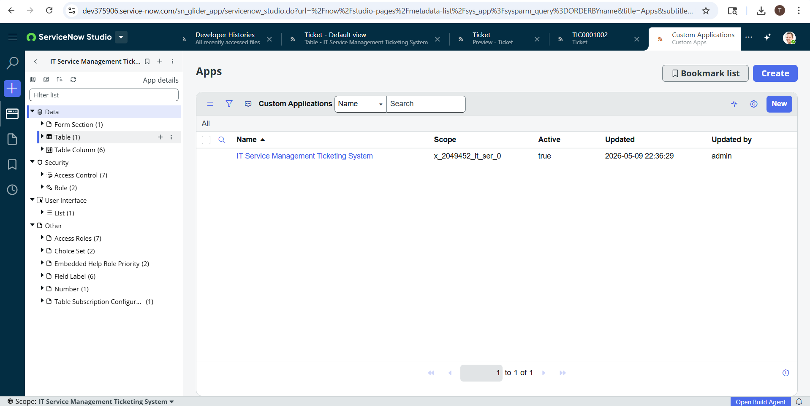
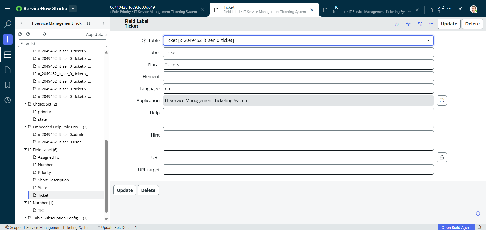
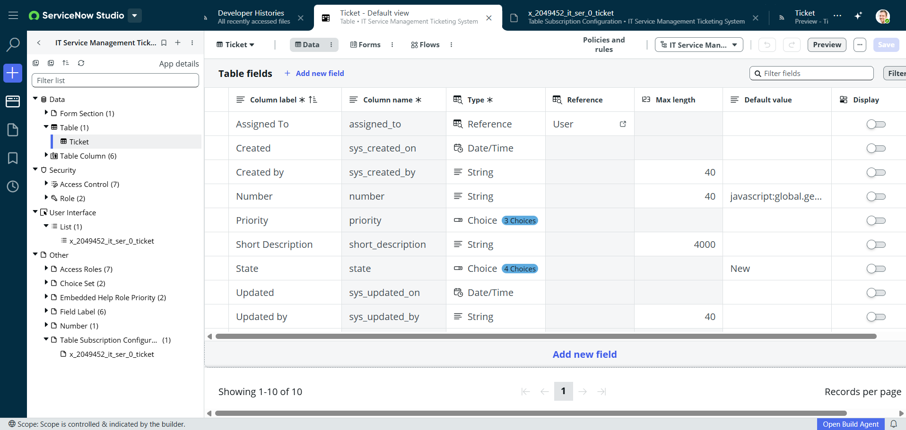
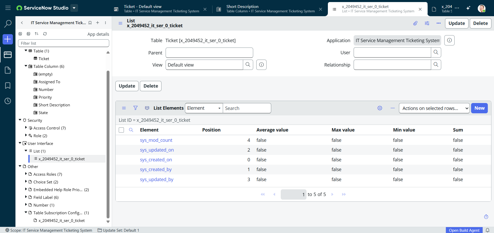
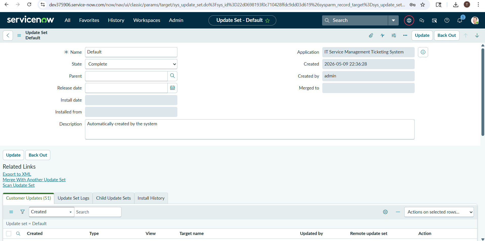
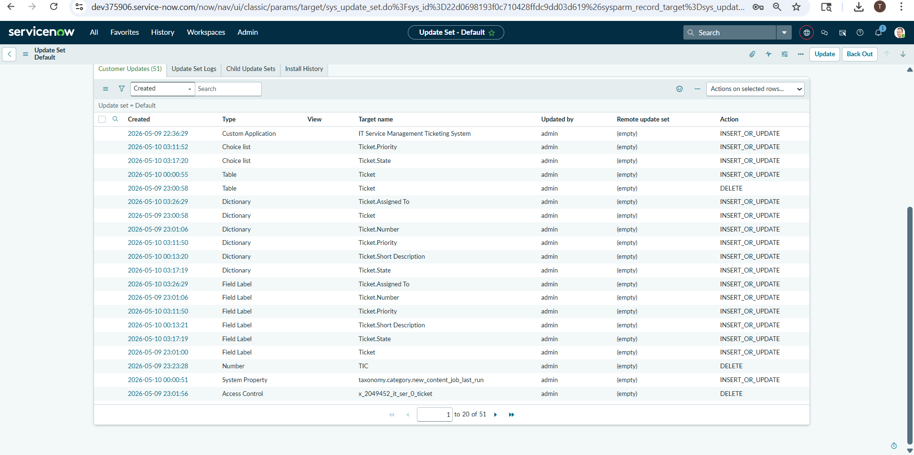
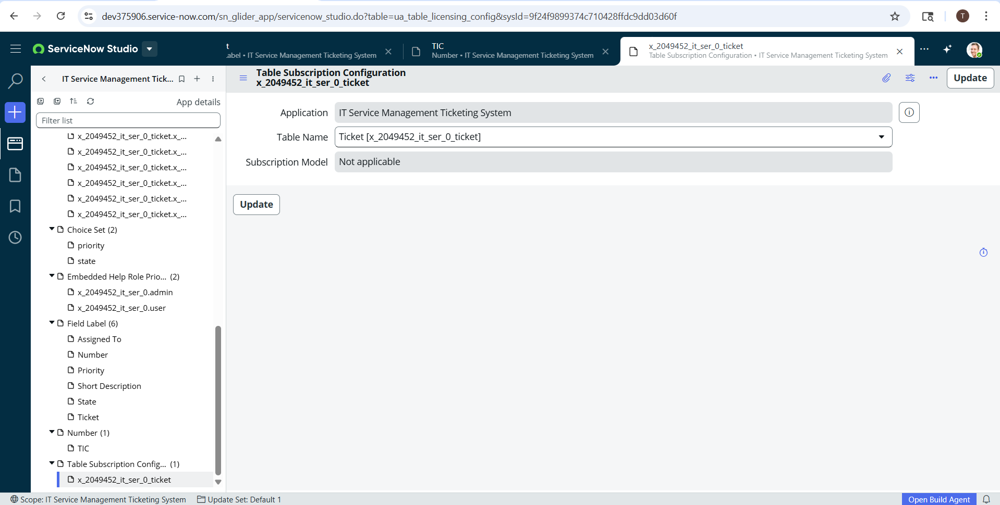

# 🚀 IT Service Management Ticketing System | ServiceNow

---

## 📌 Project Information

### 🖥️ Platform
ServiceNow Washington DC PDI

### 🌐 Scope
`x_2049452_it_ser_0`

### 📂 Project Type
Individual Project

---

## 🎯 Project Summary

The IT Service Management (ITSM) Ticketing System is a workflow-based enterprise support application developed using ServiceNow. The project automates incident management, ticket assignment, SLA tracking, and support workflow operations within an organization.

This project demonstrates practical ServiceNow development skills including scoped application development, table design, role-based access control, workflow configuration, and update set management.

---

## 🛠️ Key Features & Technical Implementation

### 🏗️ Custom Scoped Application
- Scope Name: `x_2049452_it_ser_0`

### 🎫 Incident Management Workflow
- Ticket creation and tracking
- Incident lifecycle management
- Status updates and resolution workflow

### 🗂️ Data Model & Table Design
- Table: `x_2049452_it_ser_0_ticket`

#### Key Fields
- 🔢 Number
- 📝 Short Description
- 📌 State
- ⚡ Priority
- 👨‍💻 Assigned To

### 🔐 Security & Access Control
- Custom Roles:
  - `x_2049452_it_ser_0.admin`
  - `x_2049452_it_ser_0.user`
- ✅ ACLs Implemented: 7

### ⚙️ Workflow Automation
- Priority-based ticket handling
- Assignment group routing
- Incident state management

### 📦 Deployment Artifact
- `ITSM_UpdateSet_x_2049452_it_ser_0.xml`

---

## 💻 Skills Demonstrated

- 🚀 ServiceNow Development
- 🎫 ITSM Concepts
- 📊 Incident Management
- 🏗️ Scoped Applications
- 🗄️ Table Design
- 🔐 ACLs & RBAC
- ⚙️ Workflow Configuration
- 📦 Update Set Management
- ⏱️ SLA Concepts

---

## 📁 Repository Structure

```text
Repository
│
├── README.md
├── ITSM_UpdateSet_x_2049452_it_ser_0.xml
└── screenshots
    ├── 01_servicenow_studio_proof.png
    ├── 02_Field_label_ticket.png
    ├── 03_ticket_table_fields.png
    ├── 04_List_layout_configuration.png
    ├── 05_update_set.png
    ├── 06_customer_updates_list.png
    └── 07_Table_subscription_configuration.png
```

## 🚀 How to Deploy in ServiceNow PDI

1. 📥 Download `ITSM_UpdateSet_x_2049452_it_ser_0.xml`
2. 🔎 Navigate to:
   `System Update Sets → Retrieved Update Sets`
3. 📤 Click:
   `Import Update Set from XML`
4. 📁 Upload the XML file
5. ✅ Preview Update Set
6. 🚀 Commit Update Set

---

## 📸 Project Screenshots

### 1. ServiceNow Studio


### 2. Field Configuration


### 3. Custom Table Fields  


### 4. List Layout Configuration


### 5. Update Set Configuration


### 6. Customer Updates


### 7. Table Subscription Configuration

---

## 📌 Project Outcome

This project helped in gaining hands-on experience with ServiceNow ITSM workflows, enterprise ticketing systems, workflow automation, and platform customization.

---

### 👨‍💻 Developed By
Thalamanchi Lavanya

### 🚀 Category
ServiceNow ITSM Project

### 🖥️ Deployment Date
May 10, 2026
